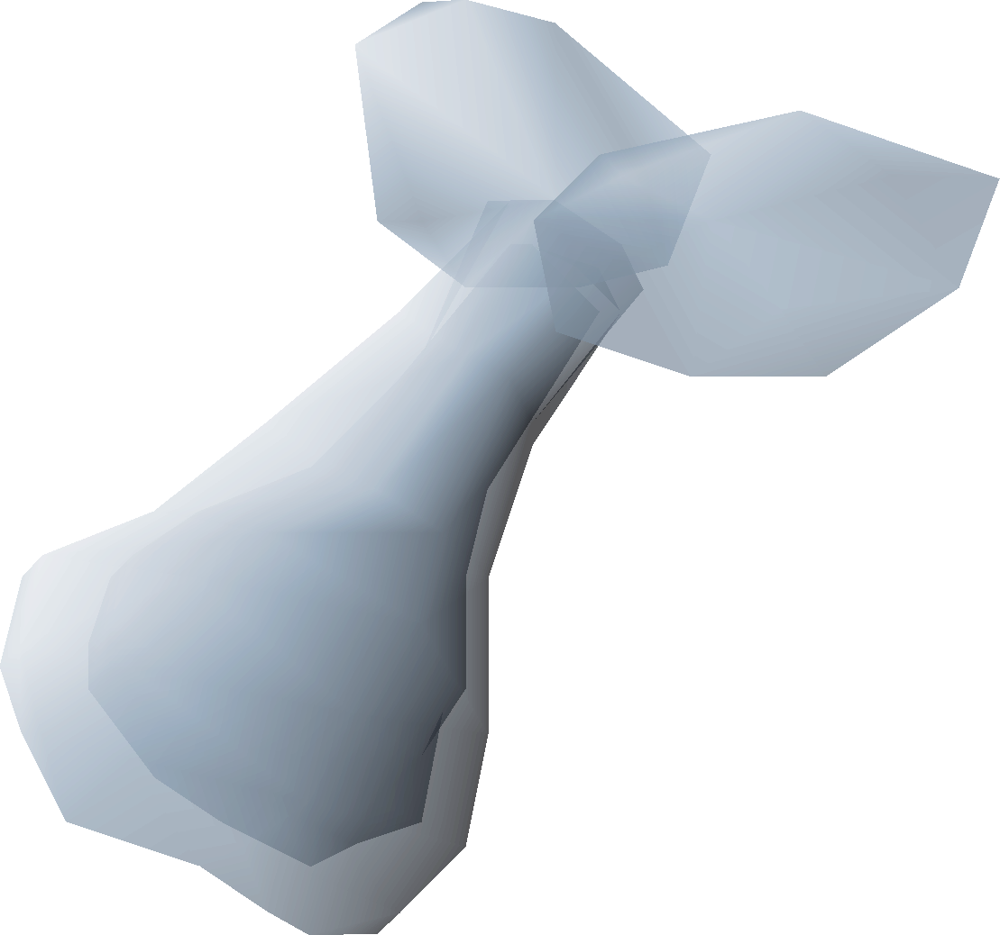
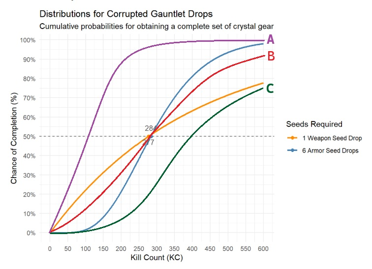

```{css, echo=FALSE}
body {
  /* background-color: #c4aa74; */
  background-image: url('images/backdrop.png'), url('images/bg2.png');
  background-repeat: repeat-y;
  background-size: 85% auto, 100% auto;
  background-position: center top, center top;
}
/* Code chunks */
pre, code {
  background-color: #ffe8b9;
}
.tocify {
  background-color: #ffe8b9;
}
.tocify-header, .tocify-item {
  background-color: #ffe8b9;
}
.tocify-item.active, .tocify-item:hover {
  background-color: #694D23;
}
blockquote {
  background-color: #f9f3e3;
  border-left: 5px solid #f0c040;
  padding: 10px 15px;
  border-radius: 4px;
}
/* Button for revealing things */
details summary {
  cursor: pointer;
  background-color: #FFCF3F;
  background-image: url('images/button.png');
  background-size: cover;
  background-position: center;
  background-repeat: no-repeat;
  width: 120px;
  height: 100px;
  border-radius: 4px;
  display: inline-flex;
  align-items: center;
  justify-content: center;
  text-align: center;
  color: white;
  font-size: 1.1em;
}
img { /* ggplot Plots */
  border: 4px solid #694D23;
}
/* Striping tables */
tr:nth-child(even) {
  background-color: #f2f2f2;
}
/* Odd rows */
tr:nth-child(odd) {
  background-color: #ffffff;
}
img.no-border {
  border: none;
}
```

```{=html}
<!-- TODO: 

  - [X] Brown / tan background for osrs theme?

  - Add in time variable, for example, if a run takes 10min, then how many 
    hours it will take to get to drop rate.
    
  - Homogenize graph formatting to look similar in theme.
  
  - Add block quote formatting (>) to equations to make them stand out more.
    
  - Add in more graphs to first sections of the doc.
    
    - Add PMF's in to show the declining count of players as KC increases.
    - And/or simulation data of X players.

  - Add in Distributions section in Appendix, showing formulae and graphs for:
    
    - Geometric
    - Binomial
    - Negative Binomial
      - show graph of PMF, where mean stays the same, but r increases, to show
        how variances decreases as r increases
      
      - Quick Definition
      - CDF (Both X and N) 
      - PMF (Both X and N)
      - Quantile Function (Both X and N)
      
      - Maybe a table of some kind to make things better looking?
    
  - Add hyperlinks to wikipedia for formulae, e.g., the Alternative formulations 
    for a negative bin dist, that shows it shifted to define X as n trials.
    
-->
```

```{r setup, include=FALSE}
library(knitr)      # Knitting to HTML output
library(kableExtra) # For better looking tables
library(ggplot2)    # For better looking plots
library(scales)     # For easier x/y scaling when plotting
library(tidyr)      # For easier data manipulation
library(plotly)     # Testing
```

> 📢 This document is best viewed on a desktop or laptop screen. 
> Some tables, plots, and formatting may not display optimally on mobile devices.

# Introduction

**Question:** How many Corrupted Gauntlet kills would you expect it would take to receive the necessary drops to craft a bow of faerdhinen and a full set of crystal armour? To answer this question, we must first understand more about how these drop rates work.

**Drop Rates:**

-   Enhanced Crystal Weapon Seed: $\frac{1}{400}$

-   Crystal Armour Seed: $\frac{1}{50}$ (need 6 for a full set)

```{r}
# Enhanced Crystal Weapon Seed drop rate
weapon_rate = 1 / 400

# Crystal Armour Seed drop rate
armour_rate = 1 / 50
```

```{r, echo=FALSE, fig.align='center', out.width='25%', out.extra='class="no-border"'}

```
(Image source: [OSRS Wiki](https://oldschool.runescape.wiki/index.php?curid=226618))


--------------------------------------------------------------------------------

# Enhanced Weapon Seed 

#### Average Kill Count

Let's start with a more simple question: what is the number of kills you would expect it would take to receive a single enhanced crystal weapon seed? In other words, what is the **expected** number of trials (**Kill Count**) for the **average player** to receive a single drop of the weapon seed?

Before we can answer that, we must first answer the question of how many **failed** trials would you expect before the **first successful** one? Using a **Geometric Distribution**, we can calculate the **expected value** (mean) of failed trials before the first success. That is to say, we can calculate the average number of kills where we don't receive a drop before the kill where the drop is expected as:

$$X \sim \text{Geom}(p) \implies E[X] = \frac{1-p}{p}; \quad X \in \{0, 1, 2, \dots\}$$

**Where:**

-   $X$: The number of failed trials (i.e., the number of kills before the kill that drops the targeted item).

-   $p$: The probability of success on any individual, independent trial.

To find the number of **total trials** $(N)$ we expect to receive the drop, we simply add our 1 success back into the equation. This can then be simplified to:

$$ N \sim \text{Geom}(p) \implies E[N] = \frac{1-p}{p} + 1 = \frac{1}{p}; \quad N \in \{1, 2, 3, \dots\} $$

**Where:**

-   $N$: The number of trials (i.e., the total kill count).

(**Note**: We are defining the constraints of X and N (e.g., $N \in \{1, 2, 3, \dots\}$) in this first section; readers can assume these definitions remain constant for all subsequent sections when defining formulae for other distributions.


And indeed, plugging in our probability of $\frac{1}{400}$ provides us with the number of KC we can expect it to take to receive 1 enhanced crystal weapon seed:

$E[N] = \frac{1}{\frac{1}{400}} = \frac{400}{1} = 400$

```{r}
p = weapon_rate # 1/400 or 0.25% Chance
(1 / p) # Mean n
```

This formula serves to prove a common intuition: if an item has a $\frac{1}{400}$ drop rate, the average player will get it in 400 kills.

#### Kill Count for a 50% Chance

But what if we wanted to know how many kills was required to have a **50% (median) chance** at a weapon seed drop? To calculate the number of failed trials (before the successful trial) needed to reach a cumulative probability $(q)$, we use an **Inverse Cumulative Distribution Function** (also known as a **Quantile Function**) for the geometric distribution.

Traditionally, the **Geometric Distribution** measures the number of **failures** that occur before the first success. The quantile function for this looks like:

$$ X \sim \text{Geom}(p) \implies F_X^{-1}(q) = Q_X(q) =\left\lceil \frac{\ln(1-q)}{\ln(1-p)} \right\rceil - 1$$ 

However, we don't just track our failures, we track our total trials (kill count) which includes the kill we receive the drop (a success). To calculate total kill count $(n)$ rather than failures, we augment this formula into what is sometimes referred to as a **Shifted Geometric Distribution**.

We call this a **shifted** geometric distribution because we are calculating **trials** (KC), not **failures**. We can define trials as $N = X + successes$. Since we are only looking for the first success, we can state:

$$N \sim \text{Geom}(p) \implies F_N^{-1}(q) = Q_N(q) =F_X^{-1}(q) + 1 = \left\lceil \frac{\ln(1-q)}{\ln(1-p)} \right\rceil$$

(**Note**: This shift also occurs for calculating $E[N]$ above, but the details are omitted and instead introduced here to simplify the introductory question. It's worthwhile to note that some sources may define the shifted distribution as the standard distribution but measuring a different random variable, like we do here for $N$. While that can make things confusing, the main takeaway from this is just understanding the idea of the distribution and when it should be used.)

**Question:** How many Corrupted Gauntlet kills would it take to reach a **50% (median) chance** of getting an Enhanced crystal weapon seed drop?

$F_N^{-1}(0.5)= \left\lceil \frac{\ln(1-0.5)}{\ln(1-\frac{1}{400})} \right\rceil$ = `r qgeom(0.5, weapon_rate) + 1`

```{r}
qgeom(0.5, weapon_rate) + 1 # Remember, we add 1 because qgeom() measures failures, not trials
```

While it may feel counter-intuitive or backwards to define the inverse CDF without ever introducing the formal CDF (And indeed, one could argue this should be included for a more holistic approach to the concepts covered here), in the interest of conciseness we will forgo covering the CDF for this distribution in this section. That being said, we can still plot a graph showing the CDF to better illustrate the accuracy of our quantile function, as well as to better visualize the shape of our distribution:

```{r weapon-cdf-plot, echo=FALSE}
kc_range = 0:600 # Kill count (n)

weapon_distrib = pgeom(kc_range - 1, prob = weapon_rate)


plot_data = data.frame(kc = kc_range)
plot_data["1 Weapon Seed Drop"] = weapon_distrib

# Our median drop rate for 1 weapon seed
labels_50_weapon = data.frame(
  target_drop = "1 Weapon Seed Drop", 
  kc_50 = qgeom(0.5, weapon_rate) + 1,
  probability = 0.50
)

# Our mean drop rate for 1 weapon seed
mean_kc = 1 / weapon_rate
mean_prob = pgeom(mean_kc, prob = weapon_rate)
mean_data = data.frame(
  target_drop = "1 Weapon Seed Drop",
  kc_mean = mean_kc,
  probability = mean_prob
)

# Pivot the data to "Long Format" for ggplot
df_long = pivot_longer(plot_data, 
                       cols = contains("Drop"), 
                       names_to = "target_drop", 
                       values_to = "probability")

weapon_plot = ggplot(df_long, aes(x = kc, y = probability, color = target_drop)) +
  geom_line(linewidth = 1) + # CDF line(s)
  
  # Add the horizontal median line
  geom_hline(yintercept = 0.50, linetype = "dashed", color = "grey35") +
  geom_point(data = labels_50_weapon, aes(x = kc_50, y = probability), size = 2) +
  geom_text(data = labels_50_weapon, aes(x = kc_50, y = probability, label = paste("Median:", kc_50)),
            color = "grey35", vjust = -0.75,hjust = 1, size = 3.5, fontface = "bold") +
  
  # Add the vertical line for mean (400)
  geom_vline(xintercept = mean_kc, linetype = "dashed", color = "grey35") +
  geom_point(data = mean_data, aes(x = kc_mean, y = probability), size = 2,) +
  geom_text(data = mean_data, aes(x = kc_mean, y = probability, label = paste("Mean:", kc_mean)),
            color = "grey35", vjust = -0.75, hjust = 1.1, size = 3.5, fontface = "bold") +
  
  # Scaling
  scale_x_continuous(breaks = seq(0, max(df_long$kc), by = 50)) +
  scale_y_continuous(labels = scales::percent, breaks = seq(0, 1, 0.1)) +
  
  # Aesthetics
  scale_color_manual(
    name = "Seeds Required",
    values = c("1 Weapon Seed Drop" = "darkorange")
  )+
  labs(
    title = "Distributions for Corrupted Gauntlet Drops",
    subtitle = "Cumulative probability for obtaining an enhanced crystal weapon seed",
    x = "Kill Count (KC)",
    y = "Chance of Completion (%)"
  ) +
  theme_minimal()

print(weapon_plot)
```

Something noteworthy about the window for this graph is that it cuts off at 600 KC. This is purely to keep the visual focused on our mean and median, as the distribution's somewhat logarithmic curve drifts towards 2,000 to achieve a 99% chance of success.

(**Note**: See the Appendix for geometric distribution's CDF formula, as well as plotted simulation data for p=1/400 that shows a wider graph detailing where the 99th percentile lies on this distribution for this p.)

```{r weapon-time-scale-math, include=FALSE}
# TESTING CDF with respect to time spent per kill
# (In separate cell to reduce load)
# TODO: Convert probs to percentages (0.5032->50.32%)

steps = list()
for (m in 7:15) {
  steps[[m-6]] = list(
    args = list(
      "x", 
      list(
        round(plot_data$kc * m / 60, 1),
        c(min(plot_data$kc * m / 60), max(plot_data$kc * m / 60))
      ), 
      list(0,1)
    ),
    label = as.character(m),
    method = "restyle"
  )
}
```


```{r weapon-time-scale-plot, echo=FALSE}
plot_ly(
  # CDF line
  plot_data,
  x = plot_data$kc * 7 / 60,
  y = ~ `1 Weapon Seed Drop`,
  type = "scatter",
  mode = "lines",
  name = "Cumulative Probability",
  hovertemplate = "Time Spent: %{x:.1f} hrs \n P(N ≤ n): %{y:.2f}"
) %>% 
  # Median line
  add_trace(
    x = c(min(plot_data$kc * 7 / 60), max(plot_data$kc * 7 / 60)),
    y = c(0.50, 0.50),
    type = "scatter",
    mode = "lines",
    line = list(color = "#595959", dash = "dash"), # plotly only allows hex vals
    name = "Median (50th Percentile)",
    inherit = FALSE
  ) %>%
  # Colored border of plot
  layout(
    margin = list(l = 5, r = 5, t = 5, b = 5),
    paper_bgcolor = "transparent",
    shapes = list(
      list(
        type = "rect",
        xref = "paper", yref = "paper",
        x0 = 0, y0 = 0, x1 = 1, y1 = 1,
        line = list(color = "#694D23", width = 3)
      )
    ),
    # X-axis formatting
    xaxis = list(
      title = list(
        text = "<b>Time (Hours)</b>",
        font = list(size = 16)
      ),
      tickfont = list(size = 16),
      ticklen = 10,
      dtick = 10
    ),
    # Y-axis formatting
    yaxis = list(
      title = list(
        text = "<b>Cumulaive Probability</b>",
        font = list(size = 16),
        standoff = 10
      ),
      tickfont = list(size = 16),
      ticklen = 5
    ),
    # Scale slider for minutes per kill
    sliders = list(list(
      steps = steps,
      active = 0,
      currentvalue = list(prefix = "Minutes per Kill: "),
      pad = list(t = 50)
    )),
    # Legend formatting
    legend = list(
        bgcolor = "white",
        bordercolor = "#694D23",
        borderwidth = 3,
        x = 1.02,
        y = 1,
        xref = "paper",
        yref = "paper"
    )
  )
```


<!-- Maybe delete this note if I add in CDF above before quantile)

(**Note**: It may feel counter-intuitive or backwards to define the inverse CDF without ever introducing the CDF for this distribution. And indeed, one could argue this should be included for a more holistic approach to the concepts covered here. However, in the interest of conciseness, and because a geometric distribution allows us to directly calculate $N$ (something we will not be able to do in )
-->

```{r, echo=FALSE, fig.align='center', out.width='25%', out.extra='class="no-border"'}

```
(Image source: [OSRS Wiki](https://oldschool.runescape.wiki/index.php?curid=317876))

------------------------------------------------------------------------

# Armour Seeds 

#### Average Kill Count

While the drop rate of a single crystal armour seed is $\frac{1}{50}$, we need **6** in total to craft a full set of armour. Using a **Negative Binomial Distribution**, we can calculate the **expected value** (mean) for the number of failures (i.e., KC before the kill that provides the drop) as:

$$X \sim \text{NegativeBinomial}(r,p) \implies E[X] = \frac{r(1-p)}{p}$$ 

**Where:**

-   $r$: The target number of successes.

-   $p$: The probability of success on any individual, independent trial.

Just like with our quantile function, our function to find the expected value here is a measurement of failures, not trials. But also similar to the previous transformation, we can fix this by adding $successes$ (which is now represented by the variable $r$) into the equation. Therefore, we can transform this equation to measure the number of **trials** we can expect to receive the 6 drops as:

$$N \sim \text{NegativeBinomial}(r,p) \implies E[N] = \frac{r(1-p)}{p} + r = \frac{r}{p}$$ 

And indeed, plugging in our number of successes needed and probability provides us with the number of KC we can expect it to take to receive 6 Crystal armour seeds:

$E[N] = \frac{6}{\frac{1}{50}} = 300$

```{r}
r = 6
p = armour_rate # 1/50, or a 2% Chance
r / p # Mean n
```

Now that we know the number of kills we would expect it would take to receive 6 armour seeds, we can move on to answer the same question we asked for the enhanced crystal weapon seed.

#### Kill Count for a 50% Chance

To answer this, we can use the **Cumulative Distribution Function** (CDF) of a **Negative Binomial Distribution**. In the interest of conciseness, we will forgo defining the conventional formulation modeling the number of failures ($X$). Instead, we will proceed directly to the parameterization for the total number of trials ($N$).

The CDF for a Negative Binomial Distribution expressed for **Kill Count** ($N$) calculates the probability that the $r^{th}$ success occurs on or before the $n^{th}$ attempt, and can be defined as:

$$N \sim \text{NegativeBinomial}(r,p) \implies F(n) = P(N \le n) = \sum_{i=r}^{n} \binom{i-1}{r-1} p^r (1-p)^{i-r}$$

**Where:**

-   $n$: The target number of attempts (kill count)

-   $r$: The target number of successes (e.g., 6 armour seeds)

-   $p$: The probability of success on any individual trial (e.g., 1/50)

As you may have noticed, this function does not contain a parameter for the targeted quantile we want to define (0.5). To find the minimum number of kills $(n)$ required to have at least a 50% chance of obtaining 6 drops, we solve for the smallest integer $n\ge6$ that satisfies:

$$N \sim \text{NegativeBinomial}(r,p) \implies F_N^{-1}(q) = Q_N(q) = \min \left\{ n \in \mathbb{Z} \mid n \ge r \text{ and } \sum_{i=r}^{n} \binom{i-1}{r-1} p^r (1-p)^{i-r} \ge q \right\}$$ 

Unlike the geometric distribution, the cumulative distribution function (CDF) for the negative binomial distribution involves a **moving summation of combinations**. Because our target variable $n$ is the upper limit of this summation, there is no closed-form algebraic solution to isolate $n$. We cannot simply 'solve for $n$' using standard algebra as we have done before.

Instead, finding the required number of trials becomes a **computational search problem**. We can incrementally test integer values of $n$ until the cumulative probability crosses our 50% threshold. Statistical software like R can easily handle this numerical search with it's built-in function qnbinom() (Notice how this looks similar to our qgeom() function from before?).

```{r}
qnbinom(0.5, 6, armour_rate) + 6 # We add our 6 "successes" to the total.
# pnbinom(284-6, 6, 1/50) # This line of code would confirm this is correct/
```

```{r armour-cdf-plot, echo=FALSE}
p = armour_rate # Drop rate (p) of 1/50
kc_range = 0:600 # Kill count (n)
r_values = 1:6 # Drops (r)

plot_data = data.frame(kc = kc_range)

for (r in r_values) {
  # Remember pnbinom() uses total_attempts - successes to get # of failures
  column_name = paste0(r, "x Drops")
  plot_data[column_name] = pnbinom(kc_range - r, size = r, prob = p)
}

labels_50 = data.frame(
  target_r = paste0(r_values, "x Drops"),
  kc_50 = qnbinom(0.5, size = r_values, prob = p) + r_values,
  probability = 0.50
)

# Pivot the data to "Long Format" for ggplot
df_long = pivot_longer(plot_data, 
                       cols = ends_with("Drops"), 
                       names_to = "target_r", 
                       values_to = "probability")

armour_plot = ggplot(df_long, aes(x = kc, y = probability, color = target_r)) +
  geom_line(linewidth = 1) +
  
  # Add the 50% markers
  geom_hline(yintercept = 0.50, linetype = "dashed", color = "grey35") +
  geom_point(data = labels_50, aes(x = kc_50, y = probability), size = 2) +
  geom_text(data = labels_50, aes(x = kc_50, y = probability, label = kc_50), 
            color = "grey35", vjust = -1, size = 3.5, fontface = "plain") +
  
  # Add a vertical line for expected KC for 6 drops (300)
  geom_vline(xintercept = 300, linetype = "dotted", linewidth = 0.8) +
  annotate(x = 300, y = 0.025, label = paste("Expected (Mean) KC Needed"), 
           color = "black",geom = "label") + 
  
  scale_x_continuous(breaks = seq(0, max(df_long$kc), by = 50)) +
  scale_y_continuous(labels = scales::percent, breaks = seq(0, 1, 0.1)) +
  
  scale_color_brewer(palette = "Spectral", name = "Seeds Required") +
  labs(
    title = "Quantile Function",
    subtitle = "Cumulative probability of obtaining 1 to 6 armour seeds at a 1/50 drop rate",
    x = "Kill Count (KC)",
    y = "Chance of Completion (%)"
  ) +
  theme_minimal()

print(armour_plot)
```

While our **expected value** tells us that the overall average to complete the armour set is 300 KC, the actual halfway point (**median**) is slightly lower, at 284 KC. This happens because the Negative Binomial distribution is right-skewed. There is a hard physical limit on how lucky a player can be: it is impossible to get 6 seeds in fewer than 6 kills. However, there is absolutely no limit on how unlucky a player can be. The small percentage of players who go exceptionally "dry" (e.g., taking 800+ KC to finish the set) pull the overall statistical average upward (i.e., to the right). As a result, more than 50% of players will actually complete their armour set before ever reaching the expected 300 KC.

```{r, echo=FALSE, fig.align='center', out.width='20%', out.extra='class="no-border"'}

```
(Image source: [OSRS Wiki](https://oldschool.runescape.wiki/index.php?curid=376376))

--------------------------------------------------------------------------------

# Both Drops

```{r both-drops-setup-cdf-plot, echo=FALSE}
kc_range = 0:600 # Kill count (n)
r = 6 # Desired drops (r) for armour seeds

armour_distrib = pnbinom(kc_range - r, size = r, prob = armour_rate)
weapon_distrib = pgeom(kc_range - 1, prob = weapon_rate)


plot_data = data.frame(kc = kc_range)
plot_data["6 Armour Seed Drops"] = armour_distrib
plot_data["1 Weapon Seed Drop"] = weapon_distrib

# Our median drop rate for 6 armour seeds
labels_50_armour = data.frame(
  target_drop = "6 Armour Seed Drops",
  kc_50 = qnbinom(0.5, size = r, prob = armour_rate) + r,
  probability = 0.50
)

# Our median drop rate for 1 weapon seeds
labels_50_weapon = data.frame(
  target_drop = "1 Weapon Seed Drop", 
  kc_50 = qgeom(0.5, weapon_rate) + 1,
  probability = 0.50
)

# Pivot the data to "Long Format" for ggplot
df_long = pivot_longer(plot_data, 
                       cols = contains("Drop"), 
                       names_to = "target_drop", 
                       values_to = "probability")

distribs_plot = ggplot(df_long, aes(x = kc, y = probability, color = target_drop)) +
  geom_line(linewidth = 1) + # CDF line(s)
  
  # Add the median line
  geom_hline(yintercept = 0.50, linetype = "dashed", color = "grey35") +
  
  # Armour seed drops
  geom_point(data = labels_50_armour, aes(x = kc_50, y = probability), size = 2) +
  geom_text(data = labels_50_armour, aes(x = kc_50, y = probability, label = kc_50), 
            color = "grey35", vjust = -1, size = 3.5, fontface = "plain") +
  
  # Weapon seed drop
  geom_point(data = labels_50_weapon, aes(x = kc_50, y = probability), size = 2) +
  geom_text(data = labels_50_weapon, aes(x = kc_50, y = probability, label = kc_50), 
            color = "grey35", vjust = 1.5, size = 3.5, fontface = "plain") +
  
  # Add a vertical line for expected KC for 6 drops (300)
  # geom_vline(xintercept = 300, linetype = "dotted", linewidth = 0.8) +
  # annotate(x = 300, y = 0.025, label = paste("Expected (Mean) KC Needed"), 
  #          color = "black",geom = "label") + 
  
  # Scaling
  scale_x_continuous(breaks = seq(0, max(df_long$kc), by = 50)) +
  scale_y_continuous(labels = scales::percent, breaks = seq(0, 1, 0.1)) +
  
  # Aesthetics
  scale_color_manual(
    name = "Seeds Required",
    values = c(
      "6 Armour Seed Drops" = "steelblue",
      "1 Weapon Seed Drop" = "darkorange"
    )
  )+
  labs(
    title = "Distributions for Corrupted Gauntlet Drops",
    subtitle = "Cumulative probabilities for obtaining a complete set of crystal gear",
    x = "Kill Count (KC)",
    y = "Chance of Completion (%)"
  ) +
  theme_minimal()

print(distribs_plot)
```

**Question:** Now that we can observe both distributions side-by-side, what do you think the **combined** distribution would look like? That is to say, what would the distribution look like for getting 1 crystal weapon seed drop **and** 6 armour seed drops?

Here's a graph with 3 different example distributions. before scrolling down to see the answer, can you guess which one is the correct combined distribution?

```{r, echo=FALSE, fig.align='left', out.width='81%'}

```

<!--  -->

```{r both-drops-full-cdf-plot, cho=FALSE}
# Distribution for the combined probability of the weapon + 6 armour seeds
both_drops_plot_data = data.frame(kc = kc_range)
both_drops_plot_data["Both Drops"] = armour_distrib * weapon_distrib

# Finding our median kc value
median_kc_row = which(both_drops_plot_data[["Both Drops"]] >= 0.50)[1]
median_kc = both_drops_plot_data$kc[median_kc_row]

# Our median combined drop rate
labels_50_combined = data.frame(
  target_drop = "Both Drops", 
  kc_50 = median_kc,
  probability = 0.50
)

# Pivot the data to "Long Format" for ggplot
both_drops_df_long = pivot_longer(both_drops_plot_data, 
                       cols = contains("Drop"), 
                       names_to = "target_drop", 
                       values_to = "probability")

combined_distribs_plot = distribs_plot + 
  geom_line(
    data = both_drops_df_long, 
    aes(x = kc, y = probability, color = target_drop), 
    color = "#006230",
    linewidth = 1
  ) +
  
  # Median combined drops
  geom_point(data = labels_50_combined, aes(x = kc_50, y = probability), color =  "#006230", size = 2) +
  geom_text(data = labels_50_combined, aes(x = kc_50, y = probability, label = kc_50), 
            color = "grey35", vjust = 1.5, size = 3.5, fontface = "plain")
```

<details>
<summary>**Click To Show Answer**</summary>
<br>
<p style='font-size:1.25em;'> If you guessed **Distribution C**, then you were correct! </p>

```{r, echo=FALSE}
# print("If you guessed **Distribution C**, then you were correct!")
plot(combined_distribs_plot)
```
</details>

<!-- Clean up this section -->

```{r}
r = 6
kc_range = 0:10000  # make sure range is large enough to capture full distribution

# Compute the CDF values
cdf_vals = pnbinom(kc_range - r, size = r, prob = armour_rate) * pgeom(kc_range - 1, prob = weapon_rate)

# Convert CDF to PMF by differencing
pmf_vals = diff(c(0, cdf_vals))

# Verify it sums to ~1 (if not, extend kc_range)
sum(pmf_vals)

# plot(pmf_vals)

# Compute mean and variance
mean_val = sum(kc_range * pmf_vals)
variance_val = sum((kc_range^2) * pmf_vals) - mean_val^2
sd_val = sqrt(variance_val)

cat("Mean:", mean_val, "\nVariance:", variance_val, "\nStd Dev:", sd_val)
```

```{r, echo=FALSE, fig.align='center', out.width='25%', out.extra='class="no-border"'}

```
(Image source: [OSRS Wiki](https://oldschool.runescape.wiki/index.php?curid=226854))

--------------------------------------------------------------------------------

# Appendix

<!-- TODO: Revisit Geometric Distribution, might not be needed anymore. -->

## Geometric Distribution

### Introduction

A Geometric Distribution models the number of failures that occur before the first success in a sequence of independent Bernoulli trials (trials with only two outcomes: success or failure).

> $$X \sim Geometric(p)$$

**Where:**

-   $X$: The random variable representing the number of failures before the first success.

-   $p$: The probability of success for each independent trial.

-   **Trial**: Each trial is independent, meaning the outcome of one roll does not affect the next (this is known as the "memoryless" property of a given distribution).

**Example:** Pretend you are rolling a die until you see a 6, the **Geometric Distribution** tells you how likely you are to fail 0 times (first roll is a 6), 1 time (second roll is a 6), and so on.

### Helpful Definitions and Formulae

```{r geom-ref-table, echo=FALSE}
# Create the data frame
geom_table = data.frame(
  Property = c(
    "PMF $P(K=k)$",
    "CDF $P(K \\le k)$",
    "Mean $E[K]$",
    "Variance $Var(K)$",
    "Quantile $Q_K(q) \\; , \\; F_K^{-1}(q)$"
  ),
  Description = c(
    "Probability of success on **exactly** trial $k$.",
    "Probability of success **on or before** trial $k$.",
    "The average number of trials expected for a success.",
    "The 'spread' or consistency of successes.",
    "Trials required to reach a specific **$q$%** chance."
  ),
  Failures_X = c(
    "$(1-p)^k p$",
    "$1 - (1-p)^{k+1}$",
    "$\\frac{1-p}{p}$",
    "$\\frac{1-p}{p^2}$",
    "$\\lceil \\frac{\\ln(1-q)}{\\ln(1-p)} \\rceil - 1$"
  ),
  Total_Trials_N = c(
    "$(1-p)^{k-1} p$",
    "$1 - (1-p)^k$",
    "$\\frac{1}{p}$",
    "$\\frac{1-p}{p^2}$",
    "$\\lceil \\frac{\\ln(1-q)}{\\ln(1-p)} \\rceil$"
  ),
  R_Implementation = c(
    "`dgeom(k - 1, p)`",
    "`pgeom(k - 1, p)`",
    "`1 / p`",
    "`(1 - p) / p^2`",
    "`qgeom(q, p) + 1`"
  )
)

# Render styled table
kable(
  geom_table,
  col.names = c(
    "Property",
    "Description",
    "Failures $(X \\in \\{0, 1, \\dots\\})$",
    "Total Trials $N \\in \\{1, 2, \\dots\\})$",
    "R Code (for $N$)"
  ),
  escape = FALSE,
  # Necessary to render Latex
  align = "clccl", # Aligning cols l,c, or r
  caption = "<b><span style='color:#000000; display:block; text-align:center;'>Geometric Distribution Reference Table</span></b>",
  format = "html"
) %>%
  kable_styling(
    bootstrap_options = c("bordered", "hover", "condensed"),
    full_width = TRUE,
    font_size = 14
  ) %>%
  row_spec(0, align = "c") %>%
  column_spec(1, bold = TRUE) %>%
  column_spec(1:5, extra_css = "vertical-align:middle;")
```

### Helpful Visualizations

```{r appendix-geom-cdf-plot, echo=FALSE}

# 1. Create a sequence of failures
failures = 0:75

# 2. Build the data frame with two sets of odds
# We use pgeom() for both 1/6 and 1/20
df = data.frame(
  x = rep(failures, 2),
  prob_val = c(
    pgeom(failures, 1/6), 
    pgeom(failures, 1/20)
    ),
  type = rep(c("1/6 Odds", "1/20 Odds"), each = length(failures))
)

# 3. Plot using the 'color' aesthetic to separate the lines
ggplot(df, aes(x = x+1, y = prob_val, color = type)) +
  geom_line(linewidth = 1) +
  # geom_point(alpha = 0.5) +
  geom_hline(yintercept = 0.50, linetype = "dashed", color = "black") +
  scale_color_manual(values = c("1/6 Odds" = "darkorange", 
                                "1/20 Odds" = "steelblue")) +
  labs(
    title = "CDF Example: Comparison of Cumulative Odds for a D6 vs a D20",
    subtitle = "How many attempts are needed to achieve a 50% chance?",
    x = "Number of Attempts",
    y = "Cumulative Probability",
    color = "Success Probability"
  ) +
  theme_minimal()
```

```{r appendix-geom-pmf-plot,echo=FALSE}

p = 1/400
n = 1000000

# Simulate data
success_trial = rgeom(n, prob = p) + 1
df = data.frame(trial = success_trial)

percentile.99 = qgeom(0.99,p)

ggplot(df, aes(x = trial)) +
  # Use geom_area or a thin-lined geom_histogram for a cleaner look at high N
  geom_histogram(aes(y = after_stat(count)), 
                 binwidth = 1, 
                 fill = "steelblue", 
                 alpha = 0.6) +
  
  # The theoretical distribution
  stat_function(
    fun = function(x) dgeom(round(x) - 1, prob = p) * n,
    color = "darkorange",
    linewidth = 1,
    linetype = "dashed"
  ) +
  
  # Vertical line for the mean
  geom_vline(xintercept = 1/p, color = "black", 
             linetype = "dotted", linewidth = 1) +
  annotate("text", x = 1/p + 50, y = 2000, label = "Mean (400)", 
           angle = 90, fontface = "italic") +
  # Vertical line for 99th percentile
  geom_vline(xintercept = percentile.99, color = "black", 
             linetype = "dotted", linewidth = 1) +
  annotate("text", x = percentile.99 + 50, y = 1500, 
           label = paste0(
             "99th percentile (", 
             format(percentile.99, big.mark = ","), 
             ")"), 
           angle = 90, fontface = "italic") +

  # Formatting
  scale_y_continuous(labels = label_comma(), expand = expansion(mult = c(0, 0.05))) +
  scale_x_continuous(breaks = seq(0, 2000, 400)) +
  coord_cartesian(xlim = c(0, 2000)) +
  labs(
    title = "PMF Example: Distribution of Trials Until First Success",
    subtitle = paste0("Simulation of one million individuals with success probability p = 1/400"),
    x = "Trial Number of First Success",
    y = "Frequency (Number of People)",
    caption = "Solid Fill: Simulated Data | Dashed Line: Theoretical PMF"
  ) +
  theme_minimal(base_size = 14) +
  theme(
    panel.grid.minor = element_blank(),
    plot.title = element_text(face = "bold", size = 16),
    axis.title = element_text(face = "bold"),
    plot.caption = element_text(hjust = 0.5, margin = margin(t = 15))
  )

```

WORK IN PROGRESS

## Negative Binomial Distribution

### Introduction

A Negative Binomial Distribution models the number of failures that occur before the $r^{th}$ success in a sequence of independent Bernoulli trials.

> $$X \sim \text{NegativeBinomial}(r, p)$$

**Where:**

-   $X$: The random variable representing the number of failures before the $r^{th}$ success.

-   $r$: The target number of successes.

-   $p$: The probability of success for each independent trial.

-   **Trial**: Each trial is independent, meaning the outcome of one trial does not affect the next.

**Example:** Pretend you are rolling a die until you see **three** 6s. The **Negative Binomial Distribution** tells you how likely you are to fail 0 times before getting three 6s, 1 time, and so on. Notice how when $r = 1$, the Negative Binomial Distribution reduces to the Geometric Distribution.

### Helpful Definitions and Formulae
```{r negbin-ref-table,echo=FALSE}
negbin_table = data.frame(
  Property = c(
    "PMF $P(K=k)$",
    "CDF $P(K \\le k)$",
    "Mean $E[K]$",
    "Variance $Var(K)$",
    "Quantile $Q_K(q) \\; , \\; F_K^{-1}(q)$"
  ),
  Description = c(
    "Probability of the $r^{th}$ success occurring on **exactly** trial $k$.",
    "Probability of the $r^{th}$ success occurring **on or before** trial $k$.",
    "The average number of trials expected for $r$ successes.",
    "The 'spread' or consistency of successes.",
    "Trials required to reach a specific **$q$%** chance."
  ),
  Failures_X = c(
    "$\\binom{k+r-1}{k}(1-p)^k p^r$",
    "$I_p(r, k+1)$",
    "$\\frac{r(1-p)}{p}$",
    "$\\frac{r(1-p)}{p^2}$",
    "$\\min \\left\\{ x \\in \\mathbb{Z} \\mid\\right.$ <br> $x \\ge 0 \\text{ and}$ <br> $\\left. \\sum_{i=0}^{x} \\binom{i+r-1}{i} p^r (1-p)^{i} \\ge q \\right\\}$"
  ),
  Total_Trials_N = c(
    "$\\binom{k-1}{r-1}(1-p)^{k-r} p^r$",
    "$\\sum_{i=r}^{k} \\binom{i-1}{r-1} p^r (1-p)^{i-r}$",
    "$\\frac{r}{p}$",
    "$\\frac{r(1-p)}{p^2}$",
    "$\\min \\left\\{ n \\in \\mathbb{Z} \\mid\\right.$ <br> $n \\ge r \\text{ and}$ <br> $\\left. \\sum_{i=r}^{n} \\binom{i-1}{r-1} p^r (1-p)^{i-r} \\ge q \\right\\}$"
  ),
  R_Implementation = c(
    "`dnbinom(k - r, r, p)`",
    "`pnbinom(k - r, r, p)`",
    "`r / p`",
    "`r * (1 - p) / p^2`",
    "`qnbinom(q, r, p) + r`"
  )
)

kable(
  negbin_table,
  col.names = c(
    "Property",
    "Description",
    "Failures $(X \\in \\{0, 1, \\dots\\})$",
    "Total Trials $(N \\in \\{r, r+1, \\dots\\})$",
    "R Code (for $N$)"
  ),
  escape = FALSE,
  align = "clccl",
  caption = "<b><span style='color:#000000; display:block; text-align:center;'>Negative Binomial Distribution Reference Table</span></b>",
  format = "html"
) %>%
  kable_styling(
    bootstrap_options = c("bordered", "hover", "condensed"),
    full_width = TRUE,
    font_size = 14
  ) %>%
  row_spec(0, align = "c") %>%
  column_spec(1, bold = TRUE) %>%
  column_spec(1:5, extra_css = "vertical-align:middle;") %>%
  footnote(
    general = "The CDF for the Failures column shows the regularized incomplete beta function $I_p(r, k+1)$. A full derivation is outside the scope of this document.",
    general_title = "**Note**:",
    footnote_as_chunk = TRUE,
    escape = FALSE
  )
```

For readers who have realized that the CDF $F_N(n)$ for a geometric distribution should be equal to the CDF for a negative binomial distribution when number of successful trials $r = 1$, here is a helpful proof showing $F_{N}^{\text{NegBin}}(n; r=1, p) = F_{N}^{\text{Geom}}(n; p)$:

$$F_{N}^{\text{NegBin}}(n; r, p) = \sum_{i=r}^{n} \binom{i-1}{r-1} p^r (1-p)^{i-r}$$

Setting $r = 1$:

$$F_{N}^{\text{NegBin}}(n; r, p) = \sum_{i=1}^{n} \binom{i-1}{0} p^1 (1-p)^{i-1}$$

Since $\binom{i-1}{0} = 1$ for all $i$, this simplifies to:

$$= \sum_{i=1}^{n} p(1-p)^{i-1}$$

Factoring out $p$:

$$= p \sum_{i=1}^{n} (1-p)^{i-1}$$

This is a finite geometric series with first term $=1$, a common ratio of $x=(1-p)$, and $n$ terms. Applying the geometric series formula $\sum_{i=1}^{n} p^{i-1} = \frac{1 - x^n}{1-x}$:

$$= p \cdot \frac{1-(1-p)^n}{1-(1-p)} = p \cdot \frac{1-(1-p)^n}{p}$$

$$= 1-(1-p)^n = F_{N}^{\text{Geom}}(n; p)$$

### Helpful Visualizations
```{r appendix-negbin-cdf-plot, echo=FALSE}
# Comparing CDFs for different r values at a fixed p
kc_range = 0:150
p_ex = 1/20
r_values_ex = c(1, 3, 6)

df = data.frame(
  x = rep(kc_range, length(r_values_ex)),
  prob_val = unlist(lapply(r_values_ex, function(r) pnbinom(kc_range - r, size = r, prob = p_ex))),
  type = rep(paste0("r = ", r_values_ex), each = length(kc_range))
)

ggplot(df, aes(x = x, y = prob_val, color = type)) +
  geom_line(linewidth = 1) +
  geom_hline(yintercept = 0.50, linetype = "dashed", color = "black") +
  scale_color_manual(values = c("r = 1" = "darkorange", "r = 3" = "steelblue", "r = 6" = "forestgreen")) +
  scale_y_continuous(labels = scales::percent, breaks = seq(0, 1, 0.1)) +
  labs(
    title = "CDF Example: Effect of Increasing Required Successes (r) on Kill Count",
    subtitle = "Cumulative probability at p = 1/20 for r = 1, 3, and 6 successes",
    x = "Number of Attempts (Kill Count)",
    y = "Cumulative Probability",
    color = "Successes Required (r)"
  ) +
  theme_minimal()
```

```{r appendix-negbin-pmf-plot, echo=FALSE}
p_sim = 1/50
r_sim = 6
n_sim = 1000000

# Simulate: sum of r geometric trials gives the trial of the r-th success
success_trial = replicate(n_sim, sum(rgeom(r_sim, prob = p_sim) + 1))
df_sim = data.frame(trial = success_trial)

mean_val = r_sim / p_sim
percentile_99 = qnbinom(0.99, size = r_sim, prob = p_sim) + r_sim

ggplot(df_sim, aes(x = trial)) +
  geom_histogram(aes(y = after_stat(count)),
                 binwidth = 2,
                 fill = "steelblue",
                 alpha = 0.6) +

  # Theoretical PMF overlay
  stat_function(
    fun = function(x) dnbinom(round(x) - r_sim, size = r_sim, prob = p_sim) * n_sim * 2,
    color = "darkorange",
    linewidth = 1,
    linetype = "dashed"
  ) +

  # Mean line
  geom_vline(xintercept = mean_val, color = "black",
             linetype = "dotted", linewidth = 1) +
  annotate("text", x = mean_val + 8, y = 15000, label = paste0("Mean (", mean_val, ")"),
           angle = 90, fontface = "italic") +

  # 99th percentile line
  geom_vline(xintercept = percentile_99, color = "black",
             linetype = "dotted", linewidth = 1) +
  annotate("text", x = percentile_99 + 8, y = 12000,
           label = paste0("99th percentile (", format(percentile_99, big.mark = ","), ")"),
           angle = 90, fontface = "italic") +

  scale_y_continuous(labels = label_comma(), expand = expansion(mult = c(0, 0.05))) +
  scale_x_continuous(breaks = seq(0, 700, 100)) +
  coord_cartesian(xlim = c(0, 700)) +
  labs(
    title = "PMF Example: Distribution of Trials Until 6th Success",
    subtitle = "Simulation of one million individuals with r = 6 successes at p = 1/50",
    x = "Trial Number of 6th Success (Kill Count)",
    y = "Frequency (Number of People)",
    caption = "Solid Fill: Simulated Data | Dashed Line: Theoretical PMF"
  ) +
  theme_minimal(base_size = 14) +
  theme(
    panel.grid.minor = element_blank(),
    plot.title = element_text(face = "bold", size = 16),
    axis.title = element_text(face = "bold"),
    plot.caption = element_text(hjust = 0.5, margin = margin(t = 15))
  )
```


## Notes

**Broadly speaking, which distribution should you use?**

-   Use **Binomial** if you have a set number of **attempts** and want to count **successes**.

-   Use **Negative Binomial** if you have a set number of **successes** and want to count **attempts**.

-   Use **Geometric** if you are only looking for the **first success** and want to count **attempts**.

```{r, echo=FALSE, fig.align='center', out.width='25%', out.extra='class="no-border"'}

```
(Image source: [OSRS Wiki](https://oldschool.runescape.wiki/index.php?curid=260313))

--------------------------------------------------------------------------------

# References

- Wikipedia for distribution formulae
- OSRS wiki for drop rates, images
- oldschool.runescape.com for background images 
- osrs.design for some color hex values
- Gamecube Jona's CG Video for inspiration

--------------------------------------------------------------------------------

# Changelog

#### Version 0.4
-   Added the Negative Binomial Distribution section in the Appendix:
    -   Added Introduction with definition, parameters, and die roll example.
    -   Added Helpful Definitions and Formulae reference table (mirroring Geometric table format).
    -   Added CDF proof showing the Negative Binomial reduces to the Geometric when r = 1.
    -   Added CDF comparison visualization.
    -   Added PMF simulation visualization.
-   Added named chunk labels to several code chunks for easier navigation.
-   Renamed section headers to shorter titles.
-   Moved decorative armour seeds image row to bottom of document after Changelog.
-   Removed redundant re-assignment of armour and weapon rates.
-   Minor code cleanup and comment adjustments.
-   Various grammar and formatting fixes / adjustments.

#### Version 0.3
-   Added the brown columns with vines background behind scroll background.
-   Added an interactive time scaling graph for weapon seed CDF.
-   Added a brown image background to button.
-   Added / Adjusted various CSS formatting:
    -   Button formatting.
    -   Added plot border color (added code to remove from other images).
-   Various grammar and formatting fixes / adjustments


#### Version 0.2
-   Added a block quote at the top of the document.
-   Created images sub-folder, moved all images to new folder.
-   Added various images from OSRS Wiki to create space between sections (Youngllef, bowfa, armor, etc.).
-   Added small image of respective seeds to weapon and armor seed headers.
-   Changed how images are shown to improve formatting.
-   Added button that hides the joint distribution plot for the "Both Drops" so that readers don't accidentally reveal the answer by scrolling down too far.
-   Added the scroll background.
-   Added / Adjusted various CSS formatting:
    -   Code background color.
    -   TOC background colors.
    -   Button color and formatting.
    -   Block quote colors and formatting.
-   Various grammar and formatting fixes / adjustments.
-   Adjusted and added to various graphs.
-   Adjusted and added to latex code.
-   Added CDF graph for weapon seed.

#### Version 0.1
-   Initial commit

--------------------------------------------------------------------------------

```{r, echo=FALSE, results='asis'}
img_tag <- ""
cat("<div style='text-align:center;'>", rep(img_tag, 6), "</div>", sep="")
```
(Image source: [OSRS Wiki](https://oldschool.runescape.wiki/index.php?curid=225987))

.

.

.

.

.

.
